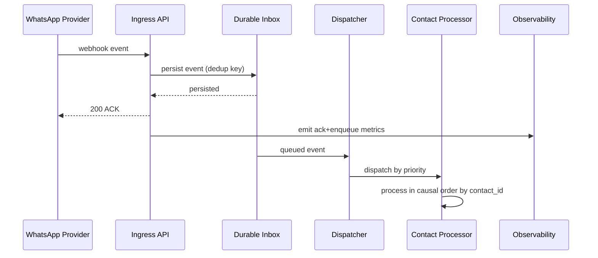
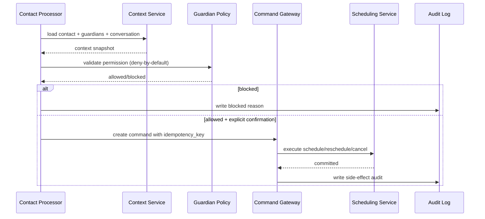
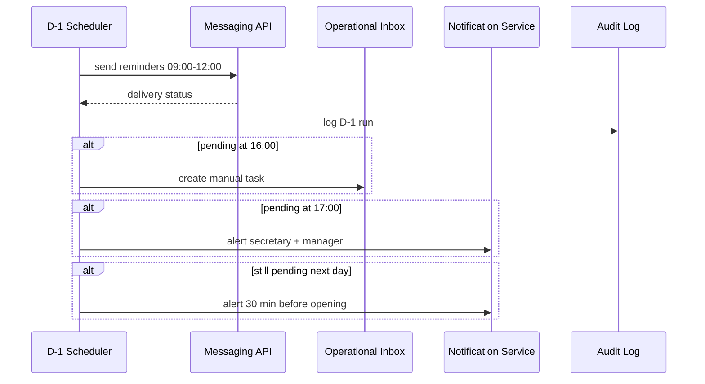
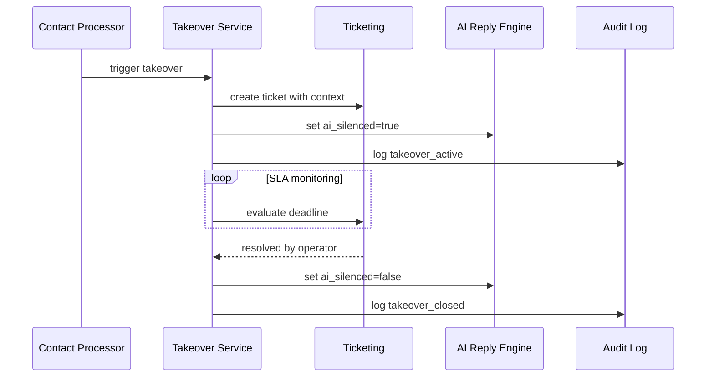
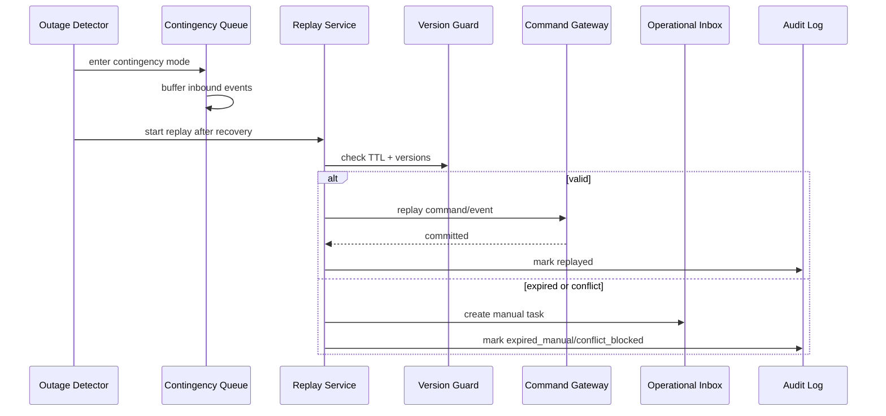
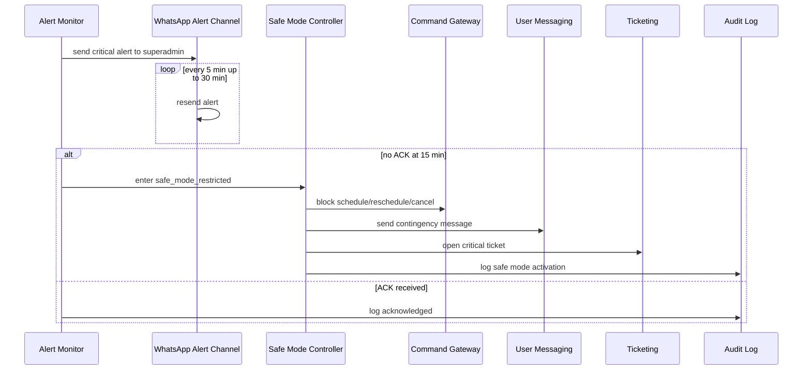
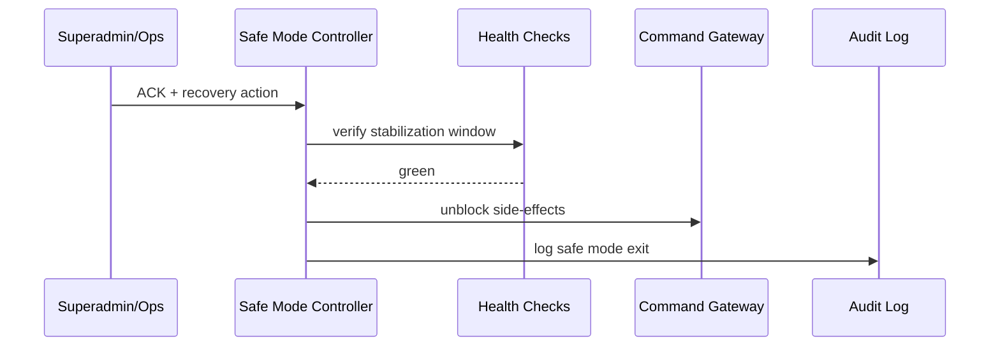

# Sequence Diagrams P0 v1

## 1. Metadata
- Project: KoraOS MVP
- Phase: 02-Architecture
- Date: 2026-02-09
- Source contracts:
  - `Docs/Phases/02-Architecture/ARCHITECTURE_P0_CONTRACTS_v1.md`

## 2. F-01 Ingress and Triage

## 3. F-02 Qualification to Scheduling

## 4. F-03 D-1 Confirmation

## 5. F-04 Human Takeover

## 6. F-05 Contingency and Replay

## 7. F-06 Safe Mode (no ACK 15 min)

## 8. Recovery Sequence (Safe Mode Exit)

## 9. Notes
1. Priority scheduling must never break causal commit order by contact stream.
2. Replay never bypasses version and TTL fences.
3. Safe mode is a command-gating state, not an ingestion stop.
